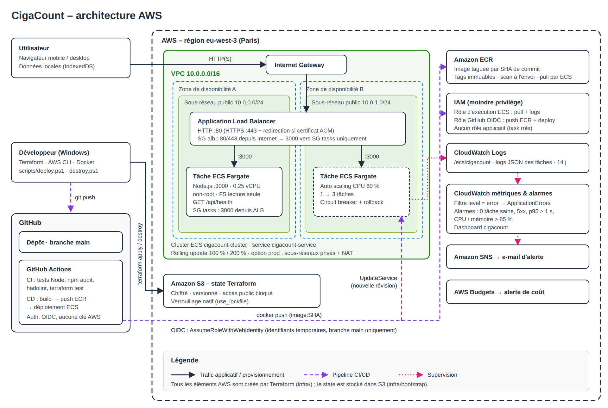

# CigaCount – Spé DevOps 3 – AWS

Déploiement automatisé d'une application web conteneurisée sur AWS (ECS Fargate), avec Terraform, GitHub Actions et CloudWatch.

L'application, CigaCount, aide un fumeur à voir ce que lui coûte sa consommation et à transformer sa réduction en épargne pour un objectif d'achat. Elle ne remplace pas un accompagnement médical (Tabac Info Service : 39 89).

- Application en ligne : http://cigacount-alb-530625861.eu-west-3.elb.amazonaws.com (jusqu'à la correction)
- Repo GitHub : https://github.com/Selimo17/CigaCount-03-Sp-DevOps-3-AWS-
- Vidéo explicative : *lien à ajouter*

## Architecture



- Un Application Load Balancer public reçoit le trafic et le transmet aux tâches ECS Fargate (conteneur Node.js, port 3000).
- Le VPC a deux sous-réseaux publics sur deux zones de disponibilité. Les tâches n'acceptent que le trafic venant du load balancer.
- L'image Docker est stockée dans Amazon ECR, taguée avec le SHA du commit.
- Les logs partent dans CloudWatch Logs. Des alarmes CloudWatch envoient un e-mail via SNS.
- Le state Terraform est stocké dans un bucket S3 chiffré.

## Contenu du dépôt

| Dossier | Contenu |
|---|---|
| `app/` | Application (Node.js / Express), `Dockerfile`, tests |
| `infra/` | Terraform : réseau, ALB, ECR, ECS, IAM, monitoring |
| `infra/bootstrap/` | Terraform : bucket S3 pour le state |
| `.github/workflows/` | Pipeline CI/CD |
| `scripts/` | Scripts PowerShell de déploiement et de destruction |
| `docs/` | Schéma d'architecture |

## Lancer en local

Avec Docker :

```powershell
docker compose up --build
```

Ou avec Node.js 22+ :

```powershell
cd app
npm ci
npm test
npm start
```

L'application est ensuite sur http://localhost:3000.

## Déploiement sur AWS

### Prérequis

- Terraform 1.10+, AWS CLI v2 et Git installés.
- Un utilisateur IAM avec une clé d'accès, configuré avec `aws configure` (région `eu-west-3`). C'est la seule étape faite dans la console AWS.

### Étapes

1. Créer le fichier de variables :

   ```powershell
   Copy-Item infra\terraform.tfvars.example infra\terraform.tfvars
   ```

   Renseigner `github_repository`, `github_owner_id`, `github_repository_id` (ids GitHub du compte et du dépôt) et `alert_email`.

2. Lancer le script, qui crée le bucket du state puis toute l'infrastructure :

   ```powershell
   powershell -ExecutionPolicy Bypass -File .\scripts\deploy.ps1
   ```

   Sans le script :

   ```powershell
   terraform -chdir=infra/bootstrap init
   terraform -chdir=infra/bootstrap apply
   terraform -chdir=infra/bootstrap output -raw backend_config | Set-Content -Encoding ascii infra/backend.hcl
   terraform -chdir=infra init "-backend-config=backend.hcl"
   terraform -chdir=infra apply
   ```

3. Dans GitHub (Settings > Secrets and variables > Actions > Variables), créer `AWS_ROLE_ARN` et `APP_URL` avec les valeurs affichées par Terraform (`github_actions_role_arn` et `app_url`).

4. Pousser sur `main` (ou lancer le workflow *Deploy* à la main) : la pipeline construit l'image et la déploie.

5. Confirmer l'abonnement SNS reçu par e-mail pour recevoir les alertes.

## Destruction

```powershell
powershell -ExecutionPolicy Bypass -File .\scripts\destroy.ps1 -IncludeBootstrap
```

Ou `terraform -chdir=infra destroy` puis `terraform -chdir=infra/bootstrap destroy`. Le dépôt ECR et le bucket sont supprimés même s'ils ne sont pas vides.

## CI/CD

- `ci.yml` (pull requests et autres branches) : tests Node, lint du Dockerfile (hadolint), build et test du conteneur, `terraform fmt`, `validate` et `test`.
- `deploy.yml` (push sur `main`) : mêmes vérifications, puis build de l'image, push sur ECR, nouvelle révision de la task definition et mise à jour du service ECS. La pipeline vérifie ensuite que `/api/health` renvoie bien la nouvelle version.

Aucun secret AWS n'est stocké dans le dépôt ni dans GitHub. La pipeline s'authentifie par OIDC : GitHub fournit un jeton temporaire, accepté par un rôle IAM uniquement pour la branche `main` de ce dépôt.

## Monitoring

- Logs de l'application (JSON) dans le groupe CloudWatch `/ecs/cigacount`, conservés 14 jours.
- Alarmes envoyées par e-mail : aucune tâche saine derrière le load balancer, erreurs 5xx, latence p95 > 1 s, CPU ou mémoire > 85 %, erreurs dans les logs (filtre `level = "error"`).
- Un dashboard CloudWatch `cigacount` et un budget AWS avec alerte.

## Choix techniques

- **ECS Fargate** : pas de serveur à gérer, plus simple qu'EKS pour un seul service.
- **Load balancer (ALB)** : point d'entrée stable, health checks, déploiements sans coupure. HTTPS possible avec un certificat ACM (`certificate_arn`).
- **Moindre privilège** : le rôle d'exécution ECS peut seulement lire l'image et écrire les logs. L'application n'a aucun droit AWS. Le rôle de la pipeline peut seulement pousser l'image et mettre à jour le service, pas modifier l'infrastructure.
- **Image Docker** : multi-stage, `node:24-alpine`, utilisateur non-root, système de fichiers en lecture seule dans ECS.
- **Données dans le navigateur (IndexedDB)** : ce sont des données de santé, elles restent sur l'appareil. Le conteneur est sans état et il n'y a pas de base de données à payer.
- **Terraform** : state dans S3 avec verrouillage, tests hors-ligne avec un provider mocké.
- **Coût** : pas de NAT gateway par défaut, une seule petite tâche. Environ 40 $ par mois, payés par les crédits du plan gratuit AWS.

## Risques et améliorations

**Sécurité**
- Le site est en HTTP : en production, ajouter un domaine et un certificat HTTPS.
- Les tâches ont une IP publique (fermée en entrée) : passer en sous-réseaux privés avec une NAT gateway (`enable_nat_gateway = true`) ou des VPC endpoints.
- Pas de protection contre les attaques web : ajouter AWS WAF.
- La clé d'accès Terraform est une clé longue durée : utiliser AWS SSO avec MFA.

**Disponibilité**
- Une seule tâche : si elle tombe, le site est coupé quelques minutes. En production, garder au moins 2 tâches, une par zone.
- Données uniquement sur l'appareil : perdues si le navigateur est vidé (l'export existe). En production, ajouter une synchronisation (API + base de données).

**Coûts**
- Le load balancer et les IP publiques coûtent même sans trafic : détruire l'environnement quand il ne sert pas.
- Pour réduire la facture : Fargate Spot, processeurs Graviton, et surveiller le budget.

## Difficultés rencontrées

- **Docker Desktop** : « Virtualization support not detected ». La virtualisation était active dans le BIOS mais l'hyperviseur Windows était désactivé. J'ai activé `VirtualMachinePlatform` et WSL, lancé `bcdedit /set hypervisorlaunchtype auto`, puis redémarré.
- **Premier déploiement refusé** : « Not authorized to perform sts:AssumeRoleWithWebIdentity ». Avec le workflow de diagnostic `oidc-debug.yml` (conservé), j'ai vu que GitHub envoie maintenant l'identité du dépôt avec des ids numériques (`repo:Selimo17@114984615/...@1387317443:...`). J'ai adapté la politique de confiance du rôle IAM.
- **PowerShell** : `-backend-config=backend.hcl` doit être entre guillemets, sinon PowerShell coupe l'argument.
- **Terraform** remplaçait la task definition à chaque `apply`, parce qu'AWS ajoute des valeurs par défaut. Je les ai écrites dans la configuration.

## Sources

- Documentation AWS : ECS (task definitions, circuit breaker), IAM OIDC, CloudWatch (filtres de métriques), tarifs Fargate et ALB.
- Documentation GitHub : OpenID Connect avec AWS.
- Documentation Terraform : provider AWS, backend S3, tests avec mocks.
- Dépôts GitHub des actions AWS (`configure-aws-credentials`, `amazon-ecs-render-task-definition`, `amazon-ecs-deploy-task-definition`).
- Documentation Docker Desktop et WSL (Microsoft).
